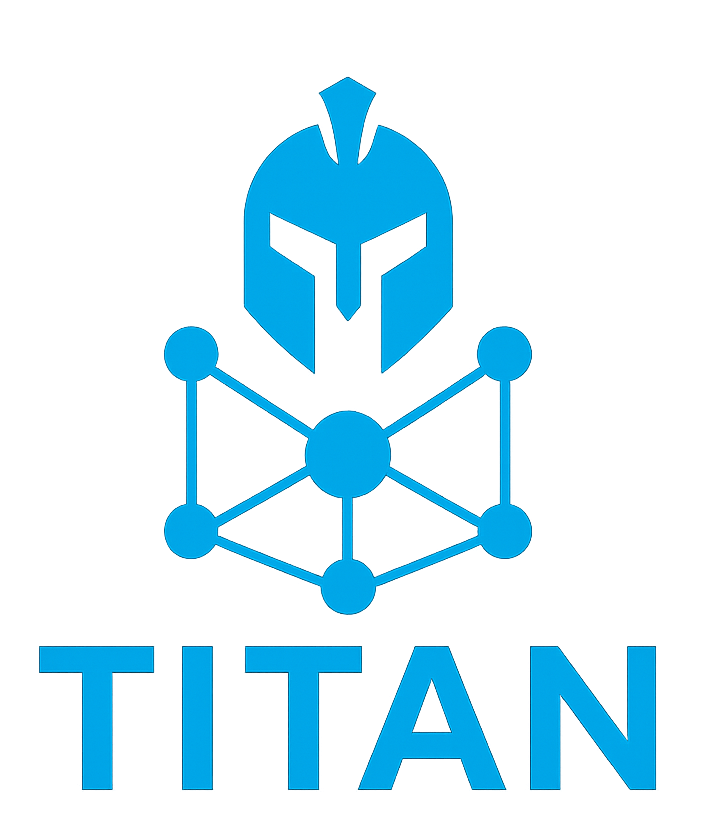

<h1 align="center">TITAN - <i>Threat Intelligence Through Automated Navigation</i></h1>

<p align="center">
  <b>A Typed & Interpretable Framework for Cyber Threat Intelligence Reasoning</b><br>
  <sub>Bridging MITRE ATT&CK, Knowledge Graphs, and Large Language Models</sub>
</p>

<p align="center">
  
</p>

<p align="center">
  <a href="#overview"></a>
  <a href="#repository-layout"></a>
  <a href="experiments/README.md"></a>
  <a href="experiments/README.md"></a>
</p>

---

## Overview

TITAN is a **typed, bidirectional knowledge graph framework** for **Cyber Threat Intelligence (CTI)** reasoning and **question answering**. It integrates data from the **MITRE ATT&CK STIX** bundles, builds a **TITAN Ontology**, and executes model-generated navigation paths over the resulting graph to return grounded entities and interpretable reasoning traces.

<h3 align="center">🎬 Demos</h3>

<p align="center">
  <a href="images/demo3.gif">
    
  </a><br>
  <sub>TITAN with Chain of Thought (CoT)</sub>
</p>

<p align="center">
  <a href="images/demo1.gif">
    
  </a><br>
  <sub>No Chain of Thought (Example 1)</sub>
</p>

<p align="center">
  <a href="images/demo2.gif">
    
  </a><br>
  <sub>No Chain of Thought (Example 2)</sub>
</p>

<p align="center">
  <a href="images/demo4.gif">
    
  </a><br>
  <sub>TITAN as a tool for a Cybersecurity Agent</sub>
</p>

---

## Repository layout

This repository is split into two parts:

```
TITAN/
├─ titan/                     # Core library: load the graph, execute paths, run a trained model
│  ├─ graph.py                 # Deterministic path execution over the CTI graph
│  ├─ evaluate.py              # Path/entity execution & scoring primitives
│  ├─ query.py                 # Interactive CLI: ask a question, get a grounded answer
│  └─ serve.py                 # Batch generation with a fine-tuned LoRA adapter (vLLM)
├─ experiments/                # Everything needed to reproduce the reported experiments
│  ├─ datasets/                 # Dataset generation, splitting, and (most of) the data itself
│  ├─ baselines/                # Prompted / fine-tuned / SPARQL / RAG baselines + results
│  ├─ utils/                    # Graph construction and dataset-building tooling
│  ├─ train*.py                 # LoRA SFT training scripts
│  └─ README.md                 # Step-by-step reproduction guide
├─ titan_graph.nt              # TITAN knowledge graph (RDF/N-Triples)
├─ stix_graph_correct.graphml  # TITAN knowledge graph (GraphML)
├─ rag_corpus_embeddings.npz   # Cached corpus embeddings for the RAG baseline
├─ images/                     # Diagrams and demo GIFs used in this README
└─ pyproject.toml
```

Use `titan/` to load the graph and query it with a trained model. Use `experiments/` to regenerate the datasets, retrain the models, and reproduce the reported results — see [experiments/README.md](experiments/README.md).

---

## Installation

```bash
python -m venv .venv
source .venv/bin/activate           # Windows: .venv\Scripts\activate
pip install -e .
```

This installs the `titan` package in editable mode, so `import titan` works from anywhere in the repository regardless of the current working directory. Two extra dependency groups cover the heavier steps:

```bash
pip install -e ".[train]"   # torch, transformers, trl, unsloth (training/inference)
pip install -e ".[serve]"   # vLLM (batch generation with a fine-tuned adapter)
```

---

## Using TITAN

Load the graph and execute a navigation path directly:

```python
from titan import graph as GA

g = GA.load_graph("stix_graph_correct.graphml")
names = GA.load_names("NAMES.txt")  # optional, for fuzzy entity matching
```

Ask a question interactively with a trained model:

```bash
python -m titan.query \
  --model MODELS/phi_titan \
  --names NAMES.txt \
  --graph stix_graph_correct.graphml \
  --rels Relationship_Descriptions.txt
```

```
INSERT A CTI QUERY (or 'exit'): Which mitigations apply to techniques used by the Carberp malware?
```

The system generates a CoT reasoning trace, an executable `<PATH>...</PATH>` plan, and the final grounded entities from the graph.

`NAMES.txt` (one node name per line) and `Relationship_Descriptions.txt` (`SOURCE: ..., TARGET: ..., DESCRIPTION: ...` per line) are plain-text exports of the graph, generated once from `stix_graph_correct.graphml` or `titan_graph.nt`; they are not tracked in this repository since they are fully derived from the graph files that already are.

A trained adapter is not included in this repository — see [experiments/README.md](experiments/README.md) to train one. For batch generation over many questions, see `titan/serve.py`.

---

## Reproducing the experiments

Dataset generation, training, baselines, and evaluation each take a few commands — see [experiments/README.md](experiments/README.md) for the full walkthrough.

---

## License

Released under the [MIT License](LICENSE).
